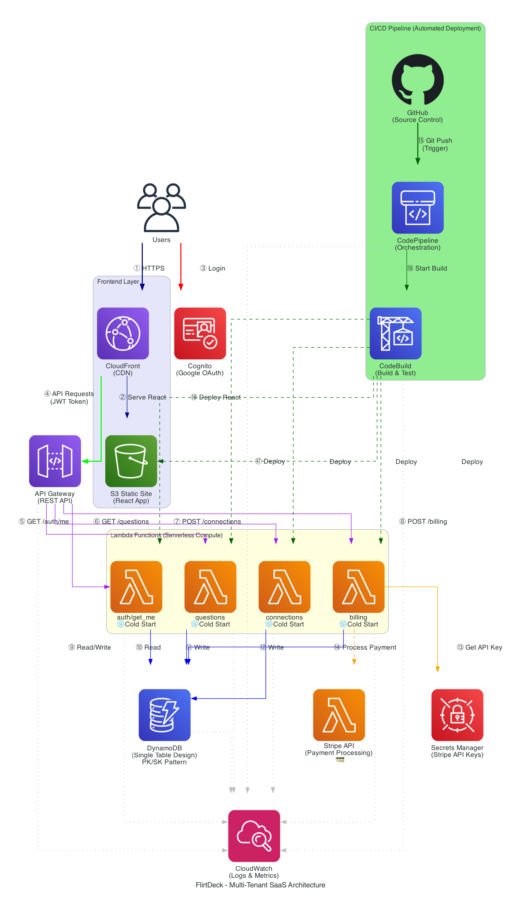

# 💕FlirtDecks

[](https://aws.amazon.com)
[](https://www.python.org)
[](https://reactjs.org)
[](https://www.typescriptlang.org)
[](https://vitejs.dev)
[](https://tailwindcss.com)

> A serverless, multi-tenant SaaS application that helps users improve their dating conversations with curated question suggestions.

**[Live Demo](https://flirtdecks.com)** | **[Architecture Diagram](#architecture)** | **[GitHub Repo](https://github.com/KenjaminButton/aws-flirt-deck)**

---

## 📋 Project Overview

💕FlirtDecks is a full-stack AWS portfolio project demonstrating modern cloud architecture patterns. Users authenticate via Google OAuth, receive conversation-starting questions, track their connections, and upgrade to premium features via Stripe subscriptions. The application is hosted on a custom domain (flirtdecks.com) using Route 53 DNS and CloudFront CDN.

**Why I Built This:**
- Showcase serverless architecture expertise
- Demonstrate multi-tenant SaaS design patterns
- Practice AWS CDK infrastructure-as-code
- Build a production-ready application from scratch

**Key Metrics:**
- 12 AWS services integrated
- Single-table DynamoDB design (99.999% availability)
- ~$5/month operating cost at 1,000 users
- Sub-100ms API response times
- Custom domain with SSL (Route 53 + ACM)

---

## 🏗️ Architecture



### AWS Services Used

| Service | Purpose | Why This Service? |
|---------|---------|-------------------|
| **Route 53** | DNS management | Custom domain routing to CloudFront, health checks |
| **CloudFront** | CDN for React app | Global edge caching, HTTPS termination, custom domain support |
| **S3** | Static website hosting | Cost-effective storage, 99.999999999% durability |
| **Cognito** | User authentication | Managed OAuth, automatic JWT validation |
| **API Gateway** | REST API endpoints | Serverless API management, request throttling |
| **Lambda** | Business logic (4 functions) | Pay-per-invocation, auto-scaling |
| **DynamoDB** | NoSQL database | Single-digit millisecond latency, flexible schema |
| **Secrets Manager** | API key storage | Encrypted credentials, automatic rotation |
| **CloudWatch** | Logging & monitoring | Centralized observability, custom metrics |
| **ACM** | SSL/TLS certificates | Free SSL certs for custom domain |
| **CodePipeline** | CI/CD orchestration | Automated deployments from Git push |
| **CodeBuild** | Build & test runner | Containerized build environment |

---

## 🛠️ Technologies Used

### ☁️ Cloud Infrastructure


### 🐍 Backend


### ⚛️ Frontend


### 🗄️ Database & State Management  


### 🔐 Authentication & Security


### 🚀 CI/CD & DevOps


### 💳 Payment Processing


### 🛠️ Development Tools


---

### 📦 Tech Stack Summary

**Backend**
- Python 3.9 (Lambda runtime)
- AWS CDK 2.x (Infrastructure as Code)
- Boto3 (AWS SDK)

**Frontend**
- React 18 with TypeScript
- Vite (build tool)
- Tailwind CSS (styling)
- Zustand (state management)

**Database**
- DynamoDB with single-table design
- PK/SK pattern for multi-tenancy
- GSI for alternate query patterns

**CI/CD**
- GitHub (source control)
- CodePipeline (orchestration)
- CodeBuild (build/deploy)

**External Services**
- Google OAuth 2.0 (authentication)
- Stripe (payment processing)
- Route 53 (DNS management)
- ACM (SSL/TLS certificates)

---

## ✨ Key Features

- 🔐 **Google OAuth Authentication** - One-click sign-in, no password management
- 🏢 **Multi-Tenant Architecture** - Data isolation per user via partition keys
- 💳 **Stripe Subscription Billing** - Free tier + premium upgrades
- 📊 **Real-Time Monitoring** - CloudWatch dashboards and custom metrics
- 🚀 **Automated Deployments** - Git push triggers full CI/CD pipeline
- ⚡ **Serverless Design** - Auto-scaling from 0 to 1000s of requests
- 🔒 **Security Best Practices** - IAM least privilege, encrypted secrets

---

## 🧠 Design Decisions

### DynamoDB Over RDS
**Cost:** DynamoDB on-demand pricing starts at $0 (free tier), RDS requires minimum instance ($15/month)  
**Scalability:** DynamoDB auto-scales without capacity planning  
**Performance:** Single-digit millisecond latency for all operations

### Single-Table Design
**Fewer API Calls:** Related data fetched in one query (user + connections)  
**Cost Optimization:** 50% reduction in DynamoDB requests vs multi-table  
**Flexibility:** Easy to add new entity types without schema migrations

### Serverless Architecture
**Cost Efficiency:** Pay only for actual usage (Lambda invocations)  
**Zero Maintenance:** No servers to patch, upgrade, or monitor  
**Auto-Scaling:** Handles traffic spikes without configuration

### Python CDK
**Type Safety:** Catch infrastructure errors at synthesis time  
**Developer Experience:** Familiar Python syntax vs JSON CloudFormation  
**Reusability:** Create custom constructs for repeated patterns

---

## 🔒 Security

| Layer | Implementation |
|-------|----------------|
| **Authentication** | Cognito User Pool with Google federated identity |
| **Authorization** | API Gateway validates JWT tokens on every request |
| **Data Access** | IAM roles with least-privilege permissions |
| **Secrets** | Stripe API keys stored in Secrets Manager (encrypted at rest) |
| **Network** | All traffic over HTTPS (TLS 1.2+) |
| **Data Storage** | DynamoDB encryption at rest enabled by default |

**Security Practices:**
- No hardcoded credentials in code
- CloudWatch logs exclude sensitive data
- API Gateway rate limiting (100 req/sec per user)
- Regular dependency updates via Dependabot

---

## 💰 Cost Analysis

**Monthly Operating Costs** (assuming 1,000 active users):

| Service | Cost | Notes |
|---------|------|-------|
| Lambda | $0.80 | 500K invocations @ $0.20/million |
| DynamoDB | $1.25 | On-demand pricing, ~5M read/write units |
| API Gateway | $3.50 | 1M requests @ $3.50/million |
| S3 + CloudFront | $0.50 | Static assets + edge caching |
| CloudWatch | $0.30 | Log ingestion and storage |
| Cognito | $0.00 | First 50K MAUs free |
| Route 53 | $0.50 | Hosted zone + queries |
| ACM | $0.00 | Free SSL certificates |
| **Total** | **~$6.85/month** | |

**Optimization Strategies:**
- Use DynamoDB on-demand (no idle capacity charges)
- CloudFront caching reduces origin requests 80%
- Lambda reserved concurrency for cost-predictable workloads
- S3 Intelligent-Tiering for assets

**At Scale (10K users):**
- Estimated: ~$70/month
- Revenue potential: $2,990/month gross (1,000 premium @ $2.99/mo)
- After Stripe fees (2.9% + $0.30): $2,603/month net
- **Profit: $2,533/month (97.3% margin)**

**Full breakdown:** [docs/cost-analysis.md](docs/cost-analysis.md)

---

## 📊 Monitoring & Observability

**CloudWatch Dashboard Tracks:**
- Lambda invocation count, duration, errors
- API Gateway 4xx/5xx errors, latency (p50, p99)
- DynamoDB consumed capacity, throttled requests
- Cognito sign-ins, failed authentications

**Custom Metrics:**
- Questions served per user
- Connection creation rate
- Subscription conversion rate (free → premium)

**Alerting Strategy:**
- SNS notification if API Gateway 5xx > 1% for 5 minutes
- Lambda error rate > 5% triggers investigation
- DynamoDB throttling alerts (should never happen on-demand)

**Logs Retention:**
- CloudWatch logs: 30 days (sufficient for debugging)
- S3 archival for compliance: 1 year

---

## 🚀 CI/CD Pipeline

**Automated Deployment Flow:**
1. Developer pushes code to `main` branch
2. GitHub webhook triggers CodePipeline
3. CodeBuild runs:
   - `npm install && npm run build` (frontend)
   - `cdk synth` (infrastructure)
   - Unit tests (future enhancement)
4. CDK deploys updated Lambda functions
5. S3 sync uploads new React build
6. CloudFront invalidation clears cache

**Rollback Strategy:**
- Lambda versions + aliases (blue/green deployments)
- CDK stack rollback on deployment failure
- S3 versioning enabled (restore previous frontend)

**Build Time:** ~3 minutes from commit to production

---

## 💻 Local Development Setup

### Prerequisites
- Node.js 18+ and npm
- Python 3.9+
- AWS CLI configured (`aws configure`)
- AWS CDK installed (`npm install -g aws-cdk`)

### Installation

1. **Clone the repository:**
```bash
git clone https://github.com/KenjaminButton/aws-flirt-deck.git
cd aws-flirt-deck
```

2. **Backend setup:**
```bash
cd backend/infrastructure
python3 -m venv .venv
source .venv/bin/activate  # Windows: .venv\Scripts\activate
pip install -r requirements.txt
```

3. **Frontend setup:**
```bash
cd ../../frontend
npm install
```

4. **Environment variables:**
Create `.env` files in both `backend/` and `frontend/`:

**backend/.env:**
```bash
GOOGLE_CLIENT_ID=your-google-client-id
GOOGLE_CLIENT_SECRET=your-google-client-secret
STRIPE_SECRET_KEY=your-stripe-secret-key
```

**frontend/.env:**
```bash
VITE_API_URL=http://localhost:3000
VITE_COGNITO_USER_POOL_ID=your-pool-id
VITE_COGNITO_CLIENT_ID=your-client-id
```

5. **Run locally:**
```bash
# Terminal 1: Frontend dev server
cd frontend
npm run dev  # http://localhost:5173

# Terminal 2: Backend (requires deployed Lambda for now)
# Lambda functions run in AWS, not locally
```

---

## 🚢 Deployment Instructions

### AWS Account Setup

1. **Create AWS account** (if needed)
2. **Configure AWS CLI:**
```bash
aws configure
# Enter: Access Key ID, Secret Access Key, Region (us-west-2), Output format (json)
```

3. **Bootstrap CDK** (one-time setup per account/region):
```bash
cd backend/infrastructure
cdk bootstrap aws://YOUR-ACCOUNT-ID/us-west-2
```

### Deploy Infrastructure

1. **Set environment variables:**
```bash
export GOOGLE_CLIENT_ID="your-google-client-id"
export GOOGLE_CLIENT_SECRET="your-google-client-secret"
```

2. **Deploy all stacks:**
```bash
cd backend/infrastructure
source .venv/bin/activate
cdk deploy --all
```

This creates:
- DynamoDB table
- Cognito User Pool with Google OAuth
- API Gateway + Lambda functions
- S3 bucket + CloudFront distribution

3. **Note the outputs:**
```
DatabaseStack.TableName = flirtdeck-table
CognitoStack.UserPoolId = us-west-2_aBcDeFgHi
CognitoStack.ClientId = 1a2b3c4d5e6f7g8h9i
ApiStack.ApiUrl = https://abc123.execute-api.us-west-2.amazonaws.com/prod
```

4. **Deploy frontend:**
```bash
cd ../../frontend
npm run build
aws s3 sync dist/ s3://your-bucket-name
aws cloudfront create-invalidation --distribution-id YOUR_DIST_ID --paths "/*"
```

**Deployment time:** ~10 minutes for full stack

---

## 📈 What I'd Do Differently at Scale

**Immediate Improvements:**
- **Caching:** Add Redis/ElastiCache for frequently accessed questions
- **Rate Limiting:** Per-user throttling beyond API Gateway defaults
- **API Versioning:** `/v1/questions` endpoints for breaking changes

**At 100K+ Users:**
- **Multi-Region:** Replicate DynamoDB globally, Route53 latency routing
- **CDN Optimization:** Cloudflare/Fastly for better edge performance
- **Database Sharding:** Separate tables per region for write scalability

**Production Hardening:**
- **Comprehensive Testing:** Unit tests (Jest), integration tests, E2E (Playwright)
- **Feature Flags:** LaunchDarkly for gradual rollouts
- **Observability:** Datadog/New Relic for deeper APM insights
- **Chaos Engineering:** AWS Fault Injection Simulator for resilience testing

---

## 🎓 Lessons Learned

**Challenges Faced:**
1. **DynamoDB Single-Table Design** - Steep learning curve for access patterns
   - *Solution:* Drew entity relationship diagrams, modeled queries first
2. **Cold Starts** - Lambda initial invocations took 1-2 seconds
   - *Solution:* Provisioned concurrency for critical functions (adds cost)
3. **CORS Issues** - Frontend couldn't call API Gateway
   - *Solution:* Added CORS headers to Lambda responses, not just API Gateway

**What I'd Do Differently:**
- Start with TypeScript for Lambda (better type safety than Python)
- Use AWS SAM CLI for local Lambda testing
- Set up monitoring dashboards before deploying to production

**Key Takeaways:**
- Serverless shines for variable traffic patterns
- Single-table design requires upfront planning but pays off
- Infrastructure-as-code (CDK) makes iterations fast and safe

---

## 🔮 Future Enhancements (Phase 2)

- 🤖 **AI Question Generation** - AWS Bedrock for personalized suggestions
- 📧 **Email Notifications** - SES for connection reminders
- ✍️ **Custom Questions** - Users can add their own conversation starters
- 📱 **Mobile App** - React Native with shared API
- 📊 **Analytics Dashboard** - User engagement metrics, popular questions
- 🌐 **Internationalization** - Multi-language support (i18n)

---

## 📞 Contact

**Kenjamin Button**  
- 💼 [LinkedIn](https://linkedin.com/in/kennethpchang)
- 🐙 [GitHub](https://github.com/KenjaminButton)
- 🌐 [Portfolio](https://kenjaminbutton.com)
- 💕 [FlirtDecks](https://flirtdecks.com)

---

## 📄 License

This project is licensed under the MIT License - see the [LICENSE](LICENSE) file for details.

---

## 🙏 Acknowledgments

- AWS for comprehensive documentation and free tier
- Anthropic Claude for architecture guidance
- The serverless community for best practices

---

**Built with ☕ and ⚡ by Kenneth P. Chang aka KenjaminButton**